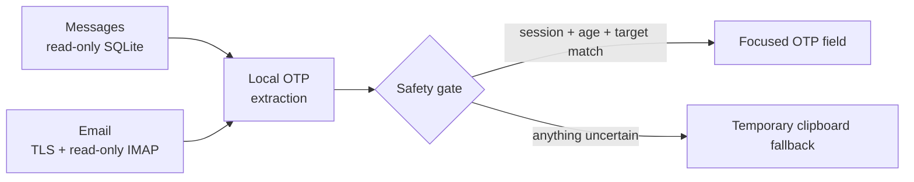

<p align="center">
  
</p>

<h1 align="center">FieldHop</h1>

<p align="center"><strong>One-time codes. One safe hop. Entirely on your Mac.</strong></p>

<p align="center">
  FieldHop carries verification codes from Messages or email to the right input field,<br>
  with local processing, explicit safety gates, and a clipboard fallback when anything is uncertain.
</p>

<p align="center">
  <a href="README.zh-CN.md">简体中文</a> ·
  <a href="SECURITY.md">Security</a> ·
  <a href="CONTRIBUTING.md">Contributing</a> ·
  <a href="CHANGELOG.md">Changelog</a>
</p>

<p align="center">
  
  
  
  
  
</p>

## The last meter of OTP autofill

Password managers can generate TOTP codes, and macOS can receive messages from an iPhone. The awkward gap is everything in between: a fresh code still has to be found, understood, matched to the active login, and placed in the correct field.

FieldHop focuses on that last meter. It is a native menu bar utility—not a cloud relay and not a CAPTCHA bypass—that handles SMS and email codes on the Mac where they arrive.



## Why FieldHop is different

| Principle | What it means in practice |
| --- | --- |
| **Local by default** | No account service, telemetry SDK, or remote message processing. Messages, parsing, matching, and filling stay on the Mac. |
| **Conservative automation** | Codes are filled only when the active session, age, host, and focused field agree. Uncertainty triggers a safe fallback instead of a guess. |
| **Real-world input coverage** | Supports numeric and alphanumeric codes, MIME email bodies, legacy message formats, segmented OTP fields, and varied login-page layouts. |
| **Human verification stays human** | CAPTCHA, sliders, text-selection challenges, and site risk controls are never bypassed. |
| **Built to be maintained** | 132 Swift tests, 16 reproducible browser-layout mocks, CI, redacted diagnostics, and zero external Swift package dependencies. |

## What it can do

- Read recent SMS and iMessage verification codes from the local Messages database.
- Monitor user-configured email accounts with TLS and read-only IMAP commands.
- Parse common OTP formats across plain text, HTML, Base64, multipart MIME, and several legacy encodings.
- Fill a focused verification field or a segmented multi-box OTP form.
- Fall back to a short-lived clipboard value when the target is not safe enough.
- Store phone numbers and email authorization codes in macOS Keychain.
- Optionally coordinate phone entry, required agreements, request-code buttons, and OTP fields through a Manifest V3 Chrome extension.

## Safety model

FieldHop treats automatic input as a policy decision, not a convenience shortcut:

1. A code must come from a recent, relevant message.
2. A matching wait or login session must still be active.
3. The foreground app, browser host, and focused field must match the expected target.
4. High-risk or ambiguous authentication content is downgraded to manual confirmation.
5. If any gate fails, FieldHop does not type the code automatically.

See [SECURITY.md](SECURITY.md) for the disclosure process and data-handling boundaries.

## Requirements

- macOS 13 or later
- Swift 5.9 or a compatible toolchain
- Messages/iMessage sync or iPhone Text Message Forwarding for SMS codes
- Google Chrome only when using the optional DOM bridge

## Build from source

Clone this repository from GitHub, then run:

```bash
cd fieldhop-macos
swift test
./scripts/package_app.sh
open ./FieldHop.app
```

Depending on the features you enable, macOS may ask for:

- **Full Disk Access** to read the local Messages database.
- **Accessibility** to inspect the focused field and simulate typing.

The local build script uses an ad-hoc signature when no matching signing identity is available. A signature change can cause macOS to request permissions again. This repository does not distribute a notarized binary yet.

## Optional Chrome bridge

1. Open `chrome://extensions`.
2. Enable **Developer mode**.
3. Choose **Load unpacked** and select the `ChromeExtension` directory.

The extension communicates only with the local bridge at `127.0.0.1:47873`. It does not persist phone numbers or OTPs. Because it needs to recognize login forms across websites, it requests broad page access; do not install it if you only need the native fallback workflow.

## Verify the project

```bash
swift test
node --check ChromeExtension/content.js
node --check ChromeExtension/service-worker.js
```

The repeatable front-link mock suite additionally requires Playwright and Google Chrome:

```bash
node scripts/run_frontlink_mock.cjs
```

## Project status

FieldHop is an early public release built from a working personal utility. The engineering baseline is tested, while real-world compatibility will continue to grow through honest reports across macOS versions, websites, message formats, and email providers. Adoption numbers are not inferred or manufactured.

Issues and focused pull requests are welcome. Please remove all phone numbers, email addresses, codes, credentials, message contents, and local paths before sharing diagnostics. See [CONTRIBUTING.md](CONTRIBUTING.md).

## License

FieldHop is available under the [MIT License](LICENSE).
