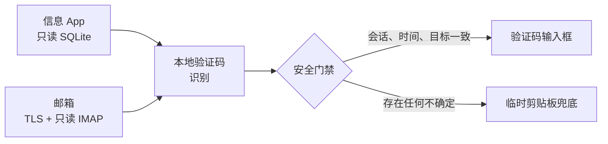

<p align="center">
  
</p>

<h1 align="center">FieldHop</h1>

<p align="center"><strong>验证码，只需安全地跳一步。全程留在你的 Mac。</strong></p>

<p align="center">
  FieldHop 把短信或邮箱中的验证码送到正确输入框；<br>
  本地处理、明确门禁，任何不确定情况都降级为剪贴板兜底。
</p>

<p align="center">
  <a href="README.md">English</a> ·
  <a href="SECURITY.md">安全政策</a> ·
  <a href="CONTRIBUTING.md">参与贡献</a> ·
  <a href="CHANGELOG.md">版本记录</a>
</p>

## 验证码自动填入的“最后一米”

密码管理器可以生成 TOTP，macOS 也能接收 iPhone 短信，但新验证码仍需要被找到、识别、匹配当前登录场景，再送进正确输入框。

FieldHop 专门解决这段“最后一米”。它是原生菜单栏工具，不是云端短信转发服务，也不会绕过人机验证；短信、邮件解析和填入判断都在本机完成。



## 为什么值得维护

| 原则 | 实际含义 |
| --- | --- |
| **本地优先** | 没有远程账号服务、遥测 SDK 或云端消息处理。验证码识别、匹配和填入都留在 Mac。 |
| **保守自动化** | 只有会话、时效、浏览器目标和焦点输入框同时匹配才自动填入，不靠猜测。 |
| **覆盖真实格式** | 支持数字、字母数字混合、MIME 邮件、旧消息格式、分格 OTP 和多种登录页布局。 |
| **人工验证仍由人完成** | 不破解 CAPTCHA、滑块、点选文字或网站风控。 |
| **可持续维护** | 132 个 Swift 测试、16 类浏览器布局 mock、持续集成、脱敏诊断，且没有外部 Swift 包依赖。 |

## 主要能力

- 从本机 Messages 数据库读取最近的短信或 iMessage 验证码。
- 通过 TLS 和只读 IMAP 命令监听用户配置的邮箱。
- 解析纯文本、HTML、Base64、多段 MIME 和多种旧字符编码。
- 填入当前验证码框或多个分格 OTP 输入框。
- 目标不够明确时使用短时剪贴板兜底。
- 手机号和邮箱授权码保存在 macOS Keychain。
- 可选 Chrome 扩展协助填写手机号、勾选必要协议、请求验证码并定位 OTP 输入框。

## 安全门禁

自动填入必须同时满足：验证码足够新、当前会话仍有效、前台 App 与浏览器域名匹配、焦点确实位于验证码输入框。高风险或语义不明确的认证内容会降级为人工确认；任何门禁失败都不会自动输入。

详细边界见 [SECURITY.md](SECURITY.md)。

## 系统要求

- macOS 13 或更高版本
- Swift 5.9 或兼容工具链
- 短信来源需要开启“信息”同步或 iPhone 短信转发
- 只有使用可选 DOM 桥时才需要 Google Chrome

## 从源码构建

先通过 GitHub 的 **Code** 菜单克隆本仓库，然后运行：

```bash
cd fieldhop-macos
swift test
./scripts/package_app.sh
open ./FieldHop.app
```

根据启用的功能，macOS 可能要求授予：

- **完全磁盘访问**：只读访问本机 Messages 数据库。
- **辅助功能**：识别当前输入框并模拟键盘输入。

没有匹配的签名身份时，构建脚本会使用临时签名。签名发生变化可能导致 macOS 重新要求授权。当前仓库尚未提供经过公证的安装包。

## 验证项目

```bash
swift test
node --check ChromeExtension/content.js
node --check ChromeExtension/service-worker.js
node scripts/run_frontlink_mock.cjs
```

## 当前阶段

FieldHop 是从真实自用工具整理出的早期开源版本。工程基线已经自动化验证，后续兼容性将通过真实、脱敏的问题报告逐步扩展；项目不会虚构用户数、下载量或采用数据。

欢迎提交 Issue 和小范围 PR。分享诊断信息前，必须删除手机号、邮箱地址、验证码、密码、授权码、消息正文和本机路径。参见 [CONTRIBUTING.md](CONTRIBUTING.md)。

## 许可证

[MIT License](LICENSE)
